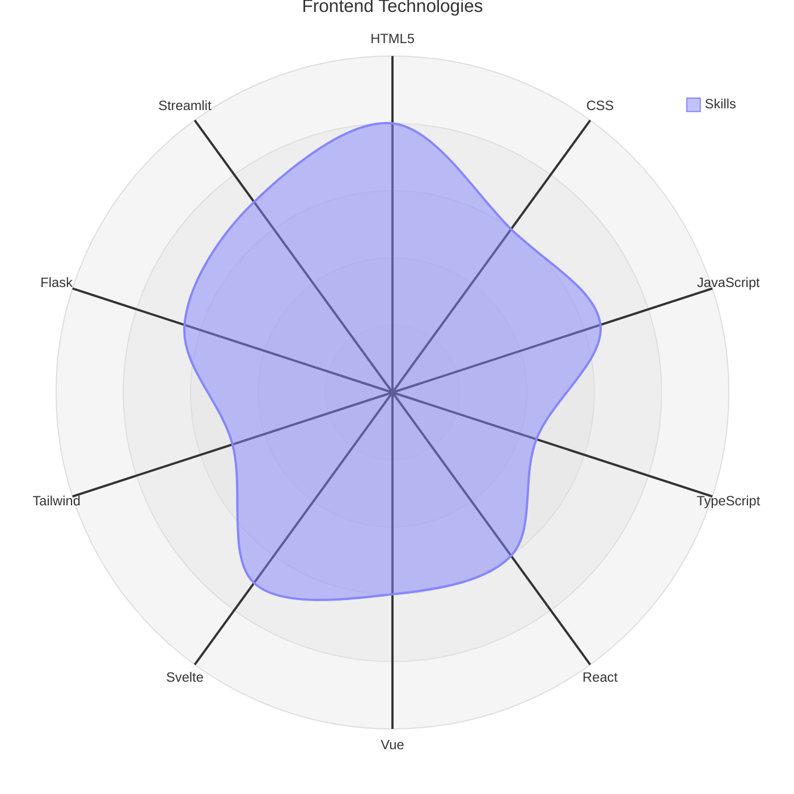
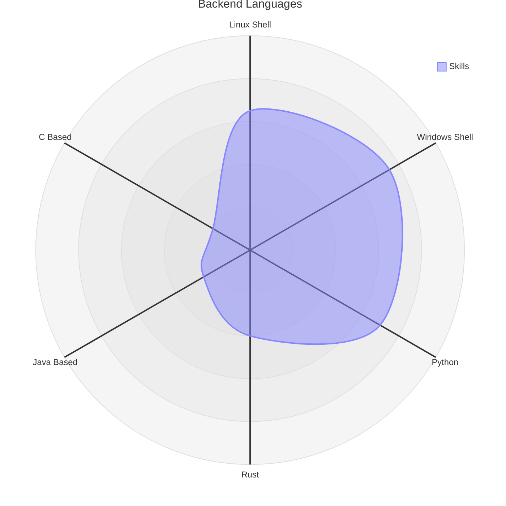
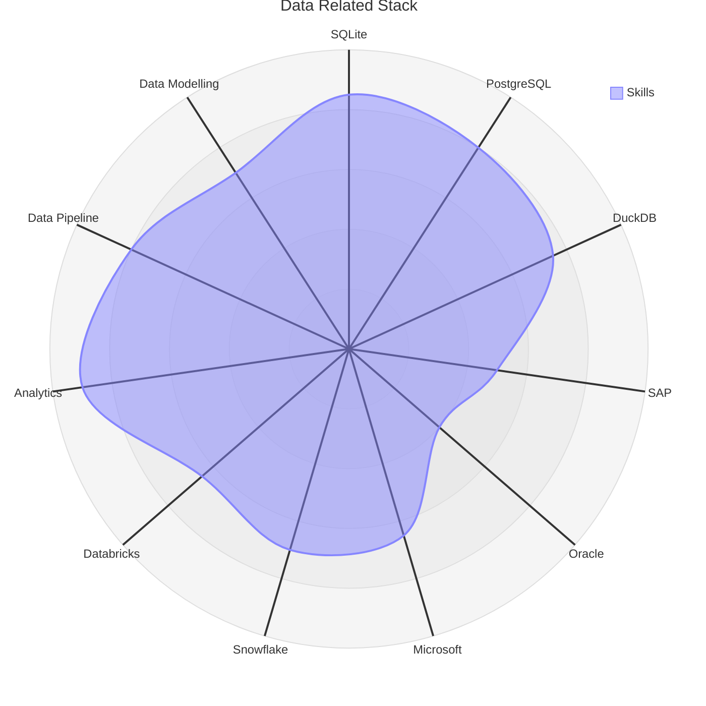
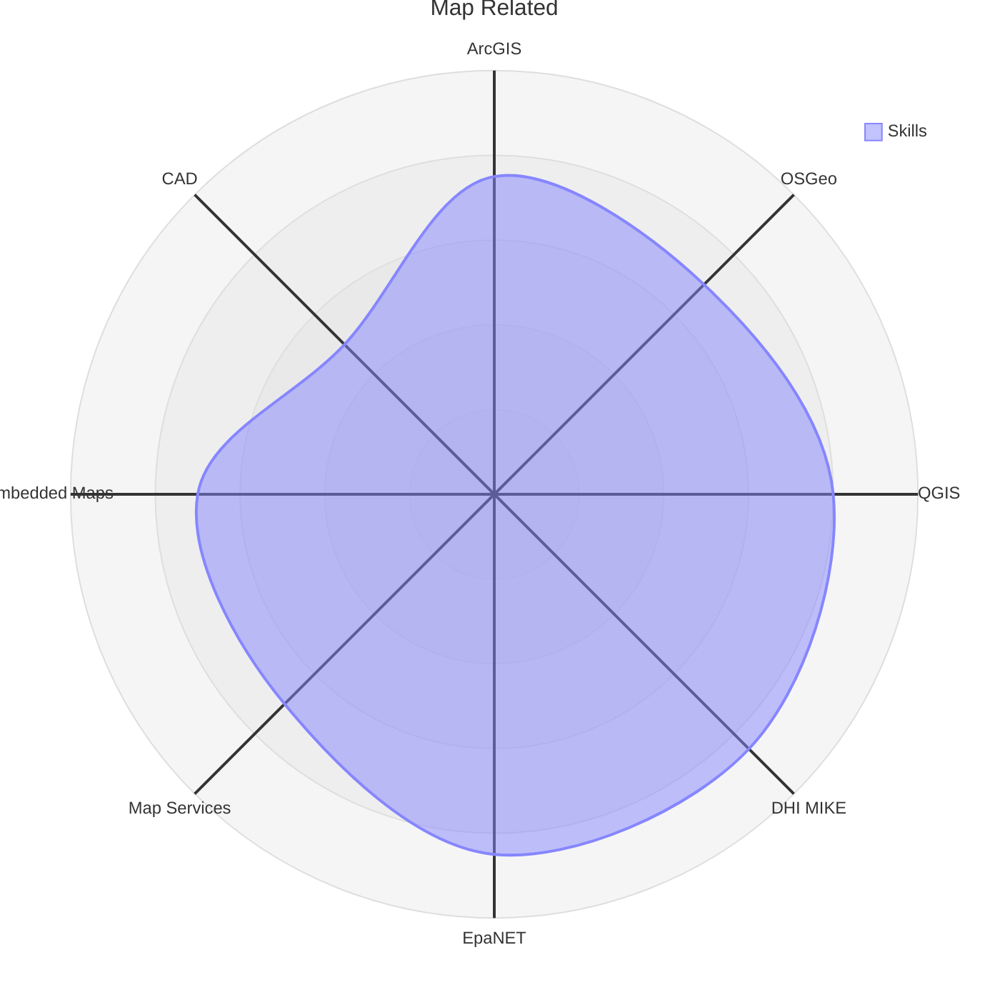
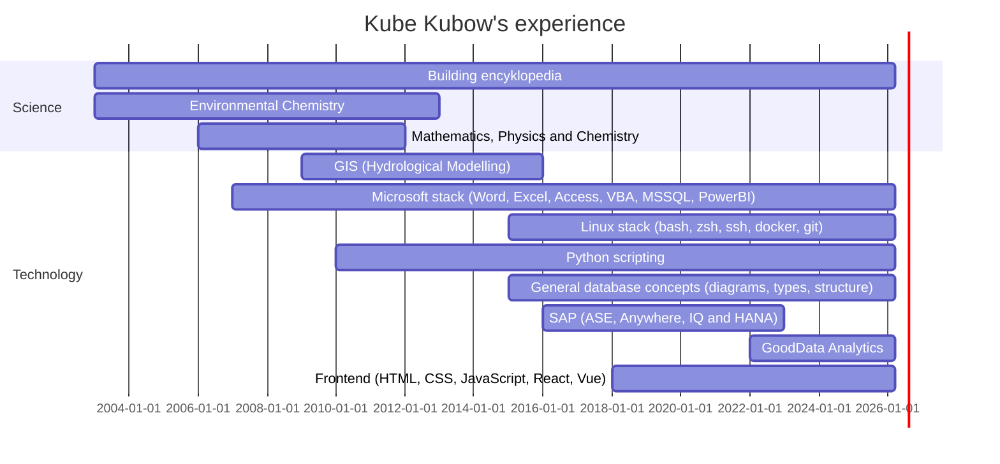

	:space_invader: :curly_loop: :wavy_dash: :curly_loop: :space_invader:

	:muscle: :small_blue_diamond: :blue_heart: :small_blue_diamond: :hand:

<h2 align="center">
	:gemini:
</h2>

## My presence is being felt here

<table>
<tr>
<td align="center">
<a href="https://github.com/kubow" target="_blank">
 
GitHub
</a>
</td>

<td align="center">
<a href="https://app.slack.com/" target="_blank">
 
Slack
</a>
</td>

<td align="center">
<a href="https://discord.com/channels/@me" target="_blank">
 
Discord
</a>
</td>

</tr>
<tr>

<td align="center">
<a href="https://stackoverflow.com/users/6905166/kube-kubow" target="_blank">
 
StackOverflow
</a>
</td>

<td align="center">
<a href="https://share.streamlit.io/user/kubow" target="_blank">
 
Streamlit
</a>
</td>

<td align="center">
<a href="https://www.quora.com/profile/Kube-Kubow?q=kubow" target="_blank">
 
Quora
</a>
</td>

</tr>
<tr>

<td align="center">
<a href="https://www.reddit.com/user/kubowww" target="_blank">
 
Reddit
</a>
</td>

<td align="center">
<a href="https://www.deviantart.com/kube-kubow" target="_blank">
 
DeviantArt
</a>
</td>

</tr>
</table>

I am currently spending the majority of my time around [GoodData's integrations](https://github.com/kubow?tab=repositories&q=gooddata&type=&language=&sort=) with various types of systems.

I have recently started collaboration on an [Astrology application](https://github.com/kefer-astrology).

My other big project is a "[Star Encyclopedia](https://github.com/kubow/h808e)" (Summarizing all things around us 🌅) with several sub-projects:

- [ARMs: various machines description](https://github.com/kubow/arms)
- [Data storing techniques](https://github.com/kubow/datastore)
- [Mapping / GIS](https://github.com/kubow/map-model)
- [Productivity](https://github.com/kubow/Productivity)
- [Programming languages](https://github.com/kubow/prg-concepts)

I am also creating small applications with a very specific usage:

- [Python database logs reader](https://github.com/kubow/Sybase_Collector) (mostly SAP, Microsoft, Oracle...)
- [Python EpaNET simple GUI](https://github.com/kubow/EpaNET-TKinter-GUI) (I plan to interconnect with Mike0/dfs)
- [Python contacts editor](https://github.com/kubow/vcf_editor) (those ancient VCards)
- [Python planet/moon compute](https://github.com/kubow/PlanetarySystemObserver) (using NASA JPL ephemerides)
- [Python universal browser/editor](https://github.com/kubow/JSONXML_editor) (currently JSON, XML and CSV files)

## Visual representation of my technology skill set

### Frontend Technologies

| Icon | Skill | Level |
| --- | --- | --- |
|  | HTML5 | 80 |
|  | CSS | 60 |
|  | JavaScript | 65 |
|  | TypeScript | 45 |
|  | React | 60 |
|  | Vue | 60 |
|  | Svelte | 70 |
|  | Tailwind | 50 |
|  | Flask | 65 |
|  | Streamlit | 70 |

### Backend Languages

| Icon | Skill | Level |
| --- | --- | --- |
|  | Linux Shell | 65 |
|  | Windows Shell | 75 |
|  | Python | 70 |
|  | Rust | 40 |
|  | Java Based | 25 |
|  | C Based | 20 |

**Note:** Linux Shell: sh, zsh, bash and various tools (like sed, grep, ...)

**Note:** Windows Shell: bat, powershell, vbscrips

### Data Related Stack

| Icon | Skill | Level |
| --- | --- | --- |
|  | SQLite | 85 |
|  | PostgreSQL | 80 |
|  | DuckDB | 75 |
|  | SAP | 50 |
|  | Oracle | 40 |
|  | Microsoft | 65 |
|  | Snowflake | 70 |
|  | Databricks | 65 |
|  | Analytics | 90 |
|  | Data Pipeline | 80 |
| - | Data Modelling | 70 |

**Note:** SAP: ASE, Anywhere, IQ and HANA

**Note:** Microsoft: MSSQL, Access, VBA, PowerBI

**Note:** Analytics: GoodData, PowerBI

**Note:** Data Pipeline: airflow, n8n, dbt, dlt, etc.

**Note:** Data Modelling: erwin, powerdesigner

### Map Related

| Icon | Skill | Level |
| --- | --- | --- |
|  | ArcGIS | 75 |
|  | OSGeo | 70 |
|  | QGIS | 80 |
|  | DHI MIKE | 85 |
|  | EpaNET | 85 |
|  | Map Services | 70 |
|  | Embedded Maps | 70 |
|  | CAD | 50 |

**Note:** Map Services: mapbox, maplibre, osm

**Note:** Embedded Maps: OpenLayers, leaflet, D3

## Record of technologies achieved

<!---
kubow/kubow is a "special" repository because its `README.md` (this file) appears on your GitHub profile.
You can click the Preview link to take a look at your changes.
Generated by update-bio workflow.
--->